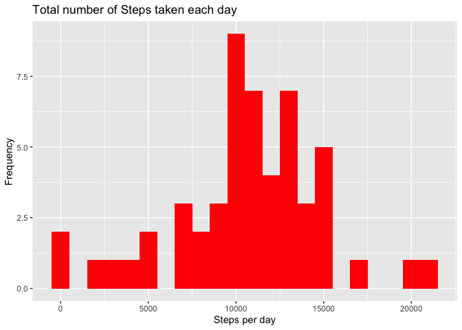
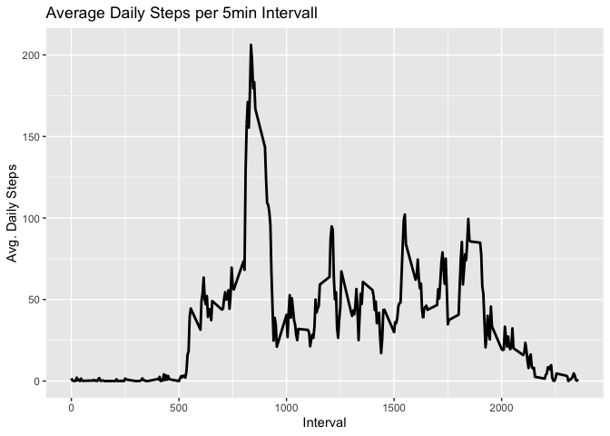
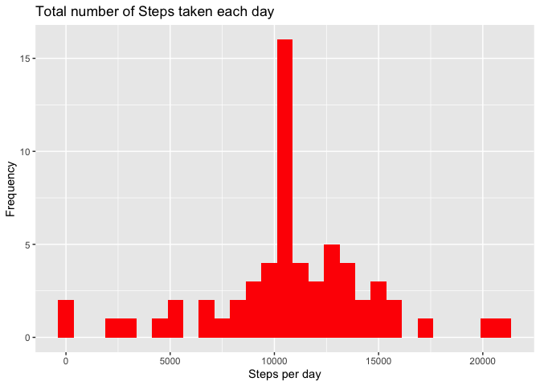
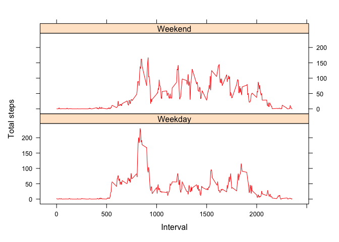

# Reproducible Research Project 1

    library(plyr)
    library(dplyr)
    library(lattice)
    library(ggplot2)

## Loading and Reading Data

    if(!file.exists("./data")){dir.create("./data")}
    fileurl <- "https://d396qusza40orc.cloudfront.net/repdata%2Fdata%2Factivity.zip"
    download.file(fileurl, destfile = "./data/activity.zip")
    unzip(zipfile = "./data/activity.zip", exdir = "./data")
            
    activity <-read.csv("./data/activity.csv")

## Task 1: What is mean total number of steps taken per day?

**Calculate the total number of steps taken per day**

    tot_steps <- aggregate(steps~date, activity, sum, na.action = na.pass)
    head(tot_steps)

    ##         date steps
    ## 1 2012-10-01    NA
    ## 2 2012-10-02   126
    ## 3 2012-10-03 11352
    ## 4 2012-10-04 12116
    ## 5 2012-10-05 13294
    ## 6 2012-10-06 15420

**Make a histogram of the total number of steps taken each day**

    ggplot(tot_steps, aes(x = steps)) +
            geom_histogram(fill = "RED", binwidth = 1000) +
            labs(title = "Total number of Steps taken each day", x = "Steps per day", y = "Frequency")

**Calculate and report the mean and median of the total number of steps
taken per day**

     mean_tot_steps <- mean(tot_steps$steps, na.rm = TRUE)
            median_tot_steps <- median(tot_steps$steps, na.rm = TRUE)     
            cat("Mean: ", mean_tot_steps, "Median: ", median_tot_steps)

    ## Mean:  10766.19 Median:  10765

## Task 2: What is the average daily activity pattern?

**Make a time series plot of the 5-minute interval (x-axis) and the
average number of steps taken, averaged across all days (y-axis)**

    ### Aggregating the mean of Steps with Intervals and ignoring NAs
    step_int <- aggregate(steps~interval, activity, mean, na.action = na.omit)

    head(step_int)

    ##   interval     steps
    ## 1        0 1.7169811
    ## 2        5 0.3396226
    ## 3       10 0.1320755
    ## 4       15 0.1509434
    ## 5       20 0.0754717
    ## 6       25 2.0943396

    ggplot(step_int, aes(x = interval , y = steps)) +
            geom_line(color="black", linewidth=1) + 
            labs(title = "Average Daily Steps per 5min Intervall", x = "Interval", y = "Avg. Daily Steps")

**Which 5-minute interval, on average across all the days in the
dataset, contains the maximum number of steps?**

    max_inter <- subset(step_int, steps == max(steps), interval)
    max_inter

    ##     interval
    ## 104      835

## Task 3: Imputing missing values

**Calculate and report the total number of missing values in the dataset
**

    sum(is.na(activity$steps))

    ## [1] 2304

**Devise a strategy for filling in all of the missing values in
thedataset.**

    #Strategy: Replace missing NA with mean of interval
            
            #Create new dataframe equal to initial activitiy_df, but replacing NA with mean of interval
            new_df <- activity
            no_NA <- subset(activity, !is.na(activity$steps))
            no_NA2 <- is.na(new_df$steps)
            avg_int <- tapply(no_NA$steps, no_NA$interval, mean, na.rm=TRUE, simplify=T)
            new_df$steps[no_NA2] <- avg_int[as.character(new_df$interval[no_NA2])]

**Create a new dataset that is equal to the original dataset but with
the missing data filled in. **

    corrected_df <- aggregate(steps~date, new_df, sum, na.action = na.omit)

**Make a histogram of the total number of steps taken each day **

    ggplot(corrected_df, aes(x = steps)) +
            geom_histogram(fill = "red", binwidth = 750) +
            labs(title = "Total number of Steps taken each day", x = "Steps per day", y = "Frequency")

**Calculate and report the mean and median total number of steps taken
per day.**

    mean(corrected_df$steps)

    ## [1] 10766.19

    median(corrected_df$steps)

    ## [1] 10766.19

**Do these values differ from the estimates from the first part of the
assignment?**

no difference

### Task 4: Are there differences in activity patterns between weekdays and weekends?

**Create a new factor variable in the dataset with two levels –
“weekday” and “weekend” indicating whether a given date is a weekday or
weekend day.**.

    new_df$date<-as.Date(new_df$date)

    day_df<-new_df %>% 
            mutate(dayType= ifelse(weekdays(new_df$date)=="Saturday" | weekdays(new_df$date)=="Sunday", "Weekend", "Weekday"))

    week_df <- aggregate(steps ~ dayType+interval, data=day_df, FUN=mean)

**Make a panel plot containing a time series plot of the 5-minute
interval (x-axis) and the average number of steps taken, averaged across
all weekday days or weekend days (y-axis)**

     library(lattice)
                    xyplot(steps ~ interval | factor(dayType),
                           layout = c(1, 2),
                           col = "red",
                           xlab="Interval",
                           ylab="Total steps",
                           type="l",
                           lty=1,
                           data=week_df)

